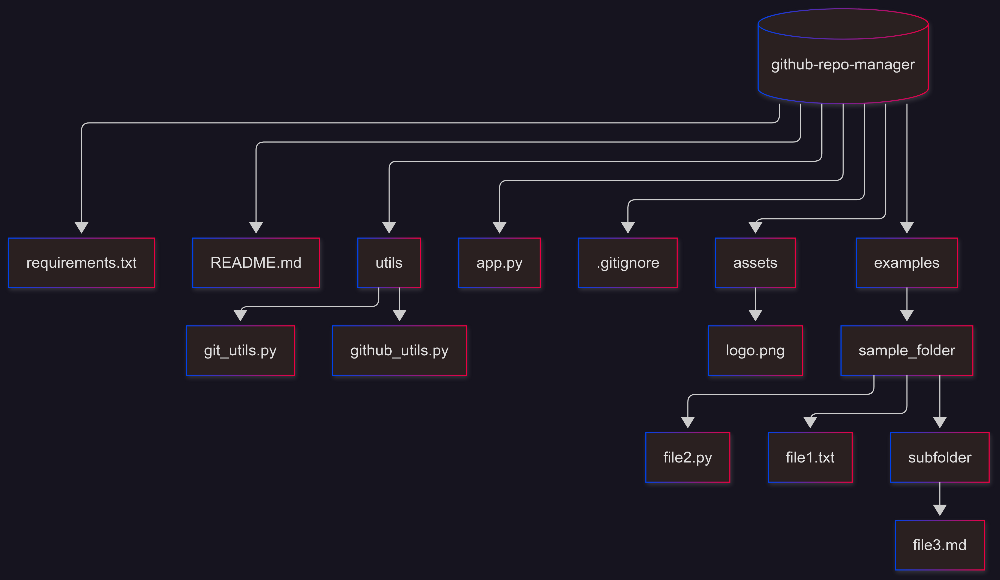

# GitHub Repository Manager (Local & Streamlit)

A **Streamlit application** for creating, managing, and uploading files to GitHub repositories from a **local folder**. Users can visually select a folder from their system, preview its **structure**, and the app handles git initialization, commit, push, and also **delete repositories** from GitHub. The app supports **drag-and-drop folders** directly into the Streamlit dashboard.

---

## 🗂️ Project Structure



- `app.py` → Launches the Streamlit dashboard.
- `utils/github_utils.py` → Handles GitHub repo creation and deletion.
- `utils/git_utils.py` → Handles local git operations (init, commit, push).
- `assets/` → Store images, icons, or logos used in Streamlit.
- `examples/sample_folder/` → Demo folder structure for testing uploads.
- `.gitignore` → Ignore files like `.DS_Store` or `__pycache__/`.

---

## ✨ Features

- Login with **GitHub Username** and **Personal Access Token (PAT)**
- **Create a new repository** (Public or Private)
- **Delete an existing repository** from your GitHub account
- Visually **select a local folder** from your system
- **Preview folder structure** before pushing files
- Automatically **git init**, **commit**, and **push** all files to GitHub
- Real-time **success and error messages** on the Streamlit dashboard
- **Drag-and-drop folders** directly into the app

---

## ⚙️ Requirements

- Python 3.8+
- Required Python packages:

```bash
pip install streamlit PyGithub gitpython
```

- Tkinter (usually comes pre-installed with Python)

------

## 🚀 How to Run

1. **Clone the repository:**

```bash
git clone https://github.com/your-username/github-repo-manager.git
cd github-repo-manager
```

1. **Run the Streamlit app:**

```bash
streamlit run app.py
```

- The Streamlit dashboard will open (usually at [http://localhost:8501](http://localhost:8501/)).

------

## 🔑 GitHub Token Setup

1. Go to **GitHub Settings → Developer settings → Personal access tokens**.
2. Generate a **new token** with **repo** access.
3. Enter your **Username** and **Token** in the app dashboard.

------

## 🖼️ App Dashboard

```
[GitHub Username]      [Personal Access Token]
[New Repository Name]  [Private? ✔️]
[📂 Browse Folder or Drag-and-Drop]
[Folder Structure Preview]
[🚀 Create Repo and Push]   [🗑️ Delete Repository]
```

- Click **Browse Folder** to open a file explorer and visually select a folder from your system.
- Or **drag-and-drop** the folder directly into the app (supported in TODO implementation).
- **Folder Structure Preview** shows all files and subfolders before commit.
- Click **Create Repo and Push** to initialize git, commit all files, and push to GitHub.
- Click **Delete Repository** to remove the selected repository from your GitHub account.

------

## 📌 Notes

- Repository will be created under your GitHub account.
- If the repo is **Private**, only you and collaborators can access it.
- All files in the selected folder will be pushed in the **initial commit** with message: `Initial commit via Streamlit app`.
- Deleting a repository is **permanent** and cannot be undone.

------

## 📢 Built With ❤️

- [Streamlit](https://streamlit.io/)
- [PyGithub](https://pygithub.readthedocs.io/)
- [GitPython](https://gitpython.readthedocs.io/)

------

## 🛠️ TODO (Future Development)

- Fully implement **drag-and-drop folders** directly into the Streamlit app

- Support **web deployment** with ZIP upload fallback

- Add **branch selection** before push

- Show **file tree preview** before commit (currently basic structure)

- Option to **select multiple folders** at once

- Add **repository search and selection** for deletion

  

  ```
  github-repo-manager/
   │
   ├─ app.py              			   # Main Streamlit app
   ├─ requirements.txt    		   # Python dependencies
   ├─ README.md           		   # Project documentation
   ├─ utils/
   │   ├─ github_utils.py    		# Functions for GitHub API interactions (create, delete repo)
   │   └─ git_utils.py      		     # Functions for git init, commit, push
   ├─ assets/
   │   └─ logo.png      		         # Optional logo or images for the dashboard
   ├─ examples/
   │   └─ sample_folder/     	       # Example local folder structure to test upload
   │       ├─ file1.txt
   │       ├─ file2.py
   │       └─ subfolder/
   │           └─ file3.md
   └─ .gitignore        		            # Ignore unnecessary local files 
  
  give me code for mermaidchart
  ```

  
